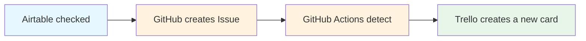

# iobdocumentsreceiving-airtable-trello-bridge

## Airtable → GitHub → Trello Automation Flow

📌Project Introduction:
This project demonstrates how to integrate Airtable’s “Documents Dispatch & Receipt Log” with GitHub Issues and Trello.  

🪄Whenever a record in Airtable is checked:
1. A new GitHub Issue is created automatically.
2. GitHub Actions detect the new Issue and call the Trello API.
3. A new card is created in the “To Do List” column of Trello.
   
🔧Using Tools:
-Airtable Automations
-Github Issue + Github Actions
-Trello Api

🚀Demonstration screenshots:

###Airtable checked records

###Trello automatically creates a new card in the TO DO List Column

## Workflow Diagram
The following flow illustrates the automation pipeline across Airtable, GitHub, and Trello.

  
## 💖Features:
-Secure management of API Keys/Tokens through GitHub Secrets
-Fully automated process
-Extensible to other project workflows

 ## 中文補充
這個專案示範如何把 Airtable 的【公文收發紀錄表】與 GitHub Issue、Trello 串接，勾選紀錄後系統會自動建立 GitHub Issue，並同步在 Trello 的 To Do List 建立卡片。
