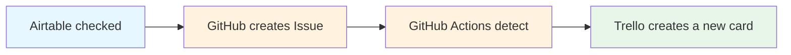

# 🚀 Automate your Airtable → GitHub → Trello workflow in one click!
# Airtable → Trello Sync
This GitHub Actions workflow syncs Airtable rows into Trello cards.

## Badge


## Table of Contents
- [Project Introduction](#project-introduction-)
- [Using Tools](#using-tools-)
- [Demonstration](#demonstration-)
- [Workflow Diagram](#workflow-diagram-)
- [Features](#features-)
- [Repository Structure](#repository-structure-)
- [Usage](#usage-)
- [Roadmap](#roadmap-)
- 中文補充

## Airtable → GitHub → Trello Automation Flow
📌Project Introduction:
This project demonstrates how to integrate Airtable’s “Documents Dispatch & Receipt Log” with GitHub Issues and Trello.  

🪄Whenever a record in Airtable is checked:
1. A new GitHub Issue is created automatically.
2. GitHub Actions detect the new Issue and call the Trello API.
3. A new card is created in the “To Do List” column of Trello.
   
🔧Using Tools:
* Airtable Automations
* Github Issue + Github Actions
* Trello API

🚀Demonstration screenshots:

1. Airtable checked records

2. Trello automatically creates a new card in the TO DO List Column

3. Watch Demo Video
[](https://www.youtube.com/watch?v=VIDEO_ID)

## Workflow Diagram
The following flow illustrates the automation pipeline across Airtable, GitHub, and Trello.

## Features:
1. Secure management of API Keys/Tokens through GitHub Secrets
2. Fully automated process
3. Extensible to other project workflows
## Setup

1. **Fork this repo**.
2. In your repo → Settings → Secrets and variables → Actions, add:

### Airtable Secrets
- `AIRTABLE_TOKEN` – Create a personal access token with `data.records:read`, `data.records: write`.
- `AIRTABLE_BASE_ID` – From your Airtable API docs (starts with `app...`).
- `AIRTABLE_TABLE_ID` – From your Airtable API docs (starts with `tbl...`).
- `AIRTABLE_FID_CHECKBOX` – Field ID of the checkbox column used to trigger card creation.
- `AIRTABLE_FID_URL` – Field ID of the text column where Trello card URL will be stored.
- `AIRTABLE_FID_DATE` – Field ID of the date column where creation date will be stored.
- `AIRTABLE_FID_SUBJECT` – Field ID of the subject/title field.
- `AIRTABLE_FID_DOCNO` – Field ID of the document number field.
- `AIRTABLE_FID_DUE` – Field ID of the due date field (optional).

### Trello Secrets
- `TRELLO_KEY` – From https://trello.com/app-key
- `TRELLO_TOKEN` – Generate on the same page after selecting your app key.
- `TRELLO_LIST_ID` – ID of the Trello List to insert new cards (use Trello API `/1/boards/{id}/lists`).
## Usage
1. Clone this repository:
   ```bash
   git clone https://github.com/your-username/iodocumentsreceiving-airtable-trello-bridge.git
2. Configure API Keys:
   * Add your Trello API Key and Token in GitHub Secrets.
   * Add your Airtable API Key if needed.
3. Run the automation:
   * Mark a record in Airtable.
   * A GitHub Issue will be created automatically.
   * A new Trello card will appear in the "To Do List" column.
   * Run the workflow (Actions → Run workflow).  
   * A new Trello card will be created, and the URL + creation date will be    written back to Airtable.

## Future Improvements / TODO
- [ ] **Integrate Slack notification**  
  Enable real-time notifications in Slack channels whenever a new Trello card is created.  
  *Value:* Improves team transparency and communication, making the workflow useful not only for individuals but also for collaborative environments.  
- [ ] **Support Airtable → Notion sync**  
  Extend the integration by sending Airtable records into Notion databases for archiving or further project management.  
  *Value:* Bridges multiple tools often used in modern workspaces, making the workflow more versatile.  
- [ ] **Add unit tests for API calls**  
  Implement automated tests (e.g., with Jest + mocked Trello API) to validate API requests and responses.  
  *Value:* Ensures the reliability and maintainability of the automation, and demonstrates professional software engineering practices.


## Repository Structure
```
├── .github/
│ └── workflows/ # GitHub Actions workflows 
│
├── images/ # Airtable, Trello demo screenshots
│ ├── airtable-demo.png
│ └── trello-demo.png
│
├── README.md 
└── LICENSE (optional) 
```
 ## 中文補充
📌 自動化管理公文紀錄，從 Airtable 到 GitHub，再同步到Trello！

這個專案示範如何把 Airtable 的【公文收發紀錄表】與 GitHub Issue、Trello 串接，勾選紀錄後系統會自動建立 GitHub Issue，並同步在 Trello 的 To Do List 建立卡片。
未來規劃:
* 未來可讓系統在建立 Trello 卡片時，同步把訊息推送到 Slack 平台，方便團隊即時掌握工作進度。
* 把 Airtable 紀錄同步到 Notion 資料庫，適合需要跨平台管理專案或做長期歸檔。
* 未來可以加上單元測試，讓系統自動檢查 API 呼叫是否正確，提升專案穩定性與專業度。
## 資料庫結構
```
├── .github/
│ └──GitHub 自動化流程設定
│
├── images/ Airtable、 Trello 專案截圖
│ ├── airtable-demo.png
│ └── trello-demo.png
│
├── README.md 專案說明文件
└── 授權檔案
```

## Author
👩‍💻 Yu-Jie Zhang  

📧 Email: Ai.yujiezhang@outlook.com  
For business inquiries regarding Aiyu Mindfulness(愛語正念): aiyumindfulness@gmail.com

🌐 Portfolio: [https://yujiezhang.com](https://sharonzhanga.wixsite.com/mysite)  
(Planning to migrate to GitHub Portfolio site soon)
